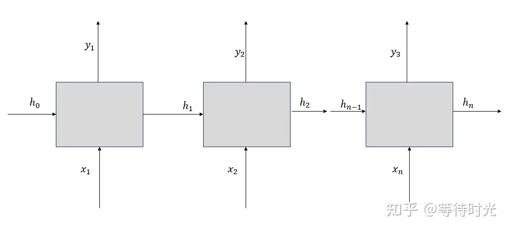
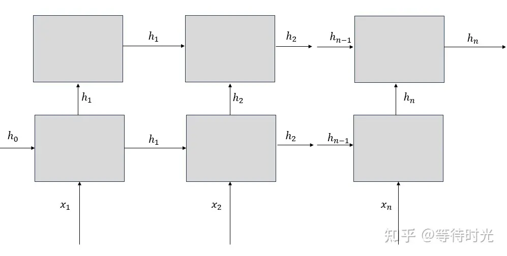

# Recurrent Neural Network
Basic RNN, Long Short-Term Memory (LSTM)，Gated Recurrent Unit (GRU). Use the daily price of gold to predict the future gold price.

## Related files: 
`daily_gold_rate.csv`: Dataset for training the model. 
<div align="center">
  
</div> 

`model.py`: Model structure for RNN, LSTM, GRU. 
<div align="center">
  
</div> 

`dataloader.py`: Create dataset suitable for the above models. 

`train.py`: Training the model and get the .pth files.

## Important concepts:
### Suitable data for model:
`batch_first` = False

Input: (seq_len, batch, feature) 

`batch_first` = True

Input: (batch, seq_len, feature) 

### Related parameters:
`input_size`: 每个时间步 (timestamp) 包含的feature数量。时间步不同于seq_len, 当seq_len=5时，代表有五个时间步。对于本项目来说，一个时间步就是金价的一个交易日，每个交易日只有一个价格，所以input_size应该为1。

`hidden_size`: 定义了隐藏状态(ht)的维度或大小，也就是每个时间步生成的隐藏状态向量的维度。隐藏层的大小越大，模型的表示能力通常越强，但同时可能需要更多的数据来训练，以避免过拟合，并且计算成本也更高。

`num_layers`: 这表示 RNN 层的数量。一个 RNN 可以有多个层，堆叠（stack）在一起以增加网络的复杂度和学习能力。当num_layers设置为2时，意味着你将堆叠两个RNN一起来形成一个堆叠RNN，并且第二个RNN块将使用第一个RNN块的输出进行计算，并且计算得到最后的结果。 
当num_layers = 1时:
<div align="center">
  
</div> 

当num_layers = 2时:
<div align="center">
  
</div> 


`output`:  
RNN and GRU: 
数据经过nn.RNN 或者 nn.GRU处理过后，产生的output包含两部分，一个是output, 一个是hidden_state.
```bash
# get output of the RNN model
out, hidden = model(input)
```

在num_layers=1时，取out[:, -1, :]和hidden[0]是一样的。 

在num_layers>1时，取out[:, -1, :]和hidden[-1]是一样的。

LSTM:
不仅有output, hidden_state, 还包括了ct（细胞状态）。
```bash
# get output of the RNN model
out, (h, c) = model(input)
```

使用 out[:, -1, :] 这种索引方式非常常见于处理序列数据的任务中，尤其是当你只需要序列最后一个时间步的输出来进行决策或预测时。在黄金价格预测中，如果你的序列是过去几天的价格，而你的任务是预测下一天的价格，你可能只需要最后一个时间步的隐藏状态来做出预测。

#### 使用两层RNN和使用两次RNN的区别：

num_layers=2，你实际上是在构建一个多层（堆叠）RNN。在这种结构中，每一层的 RNN 输出都会直接作为下一层的输入。这种堆叠方式是自动管理的，层与层之间的数据流是连续且优化的。

连续两次 RNN：每个 RNN 层都是独立的实例，即使它们的配置相同。你需要为每个层单独初始化，并且在训练时，每个层的参数更新也是独立的。这可能导致即使使用相同的输入和配置，两种方法在训练过程中的行为也可能略有不同。


### Performance and Difference
#### Training process
RNN
<div align="center">
  
</div> 

LSTM
<div align="center">
  
</div> 

GRU
<div align="center">
  
</div> 


