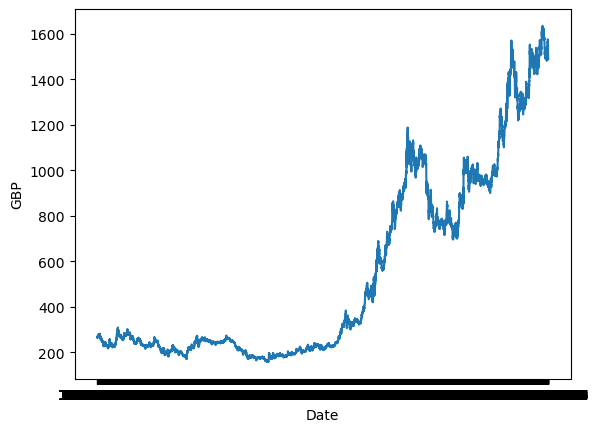
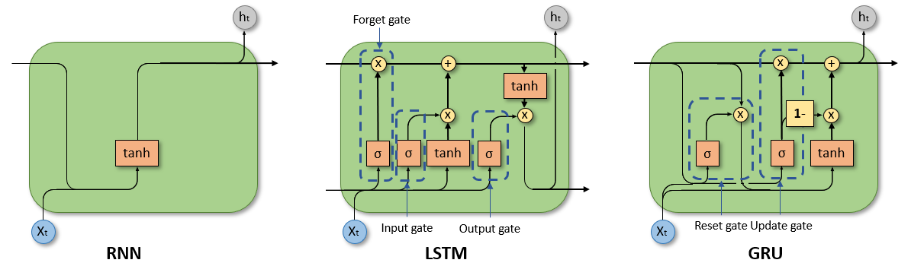

# Recurrent Neural Network
Basic RNN, Long Short-Term Memory (LSTM)，Gated Recurrent Unit (GRU). Use the daily price of gold to predict the future gold price.

## Related files: 
`daily_gold_rate.csv`: Dataset for training the model. 

  

 

`model.py`: Model structure for RNN, LSTM, GRU. 

  

 

`dataloader.py`: Create dataset suitable for the above models. 

`train.py`: Training the model and get the .pth files.

## Important concepts:
### Suitable data for model:
`batch_first` = False

Input: (seq_len, batch, feature) 

`batch_first` = True

Input: (batch, seq_len, feature) 

### Related parameters:
`input_size`: 每个时间步 (timestamp) 包含的feature数量。时间步不同于seq_len, 当seq_len=5时，代表有五个时间步。对于本项目来说，一个时间步就是金价的一个交易日，每个交易日只有一个价格，所以input_size应该为1。

`hidden_size`: 定义了隐藏状态(ht)的维度或大小，也就是每个时间步生成的隐藏状态向量的维度。隐藏层的大小越大，模型的表示能力通常越强，但同时可能需要更多的数据来训练，以避免过拟合，并且计算成本也更高。

`num_layers`: 这表示 RNN 层的数量。一个 RNN 可以有多个层，堆叠（stack）在一起以增加网络的复杂度和学习能力。当num_layers设置为2时，意味着你将堆叠两个RNN一起来形成一个堆叠RNN，并且第二个RNN块将使用第一个RNN块的输出进行计算，并且计算得到最后的结果。

`output`

### The difference between RNN, LSTM and GRU:

